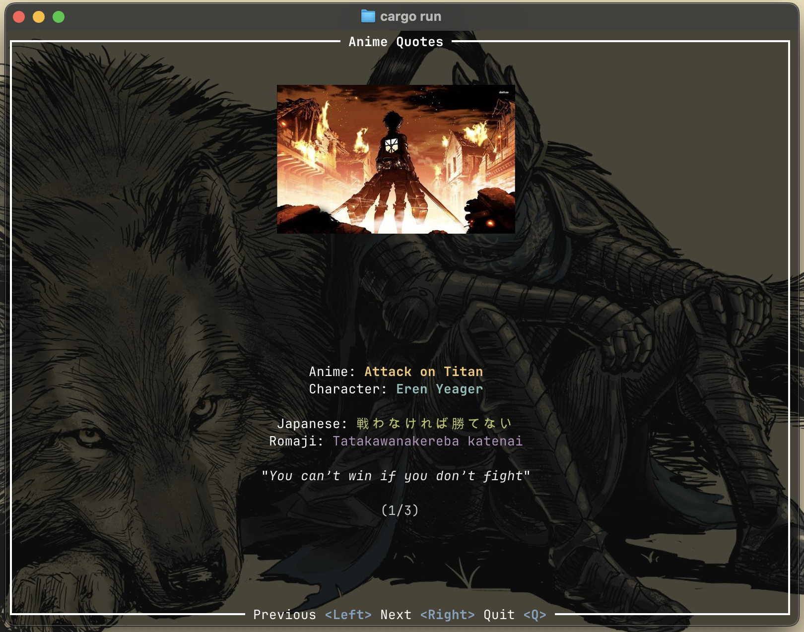

# Anime Quotes TUI



## Overview

Anime Quotes TUI is a small terminal app that lets you browse iconic anime lines while the original artwork renders inline. Quotes and media come from `anime.toml`; runtime rendering uses the image protocols (Kitty/Sixel or half blocks) provided by [`ratatui-image`](https://github.com/benjajaja/ratatui-image), so every slide keeps a consistent footprint on screen.

## Getting Started

```bash
cargo run
```

Use the arrow keys to move between quotes and press `q` to exit.

## Configuration

- Edit `anime.toml` to add or update quotes, optional romaji, and their image paths.
- Tweak `config.toml` to adjust image target width/height, scaling filter, and UI colors (including the dedicated romaji color).
- A terminal with Kitty or Sixel graphics support gives the best results. (i tested in Ghostty btw)

## License

Released under the MIT License. See [LICENSE](LICENSE) for details.
